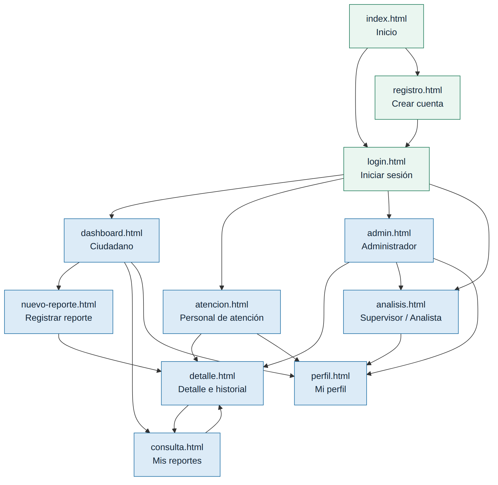

# EcoReport · Prototipo front-end navegable (HTML5 + CSS3)

Sistema web para el reporte y seguimiento de problemas ambientales (desperdicio de agua, acumulación de basura, fugas, tiraderos clandestinos).
**Actividad 9 · Aplicaciones Web · Universidad Tecnológica de León · ITIID**

> Prototipo **solo con HTML5 y CSS3**: sin backend, **sin JavaScript** y sin Bootstrap. Los datos son ejemplos escritos en el HTML.

- **Demo en línea:** _pegar aquí el enlace de GitHub Pages_
- **Repositorio:** _pegar aquí el enlace de GitHub_

---

## 1. Integrantes y roles

Equipo **EcoReport**. Con 4 integrantes se fusionan los roles 4 y 5 del documento de la actividad. **Completen la columna «Integrante»**; todos deben hacer commits.

| Rol | Responsabilidad principal | Integrante |
|---|---|---|
| 1. Coordinador y gestor del repositorio | Tablero, ramas, pull requests, integración en `main` | _por asignar_ |
| 2. Diseñador UX/UI | Guía de estilo, wireframes, `css/styles.css` y componentes compartidos | _por asignar_ |
| 3. Desarrollador Front-End 1 (acceso) | Inicio, Login y Registro (con validación HTML5 en sus formularios) | _por asignar_ |
| 4. Desarrollador Front-End 2 (módulos) | Dashboard, nuevo reporte, consulta, detalle, atención, administración, estadísticas y perfil | _por asignar_ |

Integrantes (según la Actividad 3): Daniela Irazu González Luna, Ximena de la Luz Cortez Aguirre, Josué Andrés Melchor Chávez y Gabriel Eduardo Rodríguez Magaña. Docente: Ma. de Jesús Sánchez Solis.

## 2. Tecnologías

HTML5 semántico · CSS3 propio (variables `:root`, sin plantillas ni frameworks) · Git/GitHub. Tipografías de Google Fonts (**Sora** y **Source Sans 3**) con fuentes de respaldo del sistema.

### Cómo se logra la interactividad sin JavaScript

| Comportamiento | Técnica |
|---|---|
| Validación de formularios | Atributos HTML5 `required`, `pattern`, `minlength`, `type="email"`; mensajes con `:user-invalid` |
| Menú hamburguesa | `input type="checkbox"` + `label` + selector `:checked` |
| Pestañas (Administración) | `input type="radio"` + selector `:checked ~` |
| Ventanas modales | Enlaces a un `id` + selector `:target` |
| Mensajes de resultado | Selector `:target` (por ejemplo `login.html#registrado`) |
| Filtros de la tabla | Radios + selector `:has()` |
| Detalle de cada reporte | Un bloque por reporte, visible según el ancla (`detalle.html#er-001`) |
| Barras y dona de estadísticas | Clases de ancho (`w-50`) y `conic-gradient` |

Límites del enfoque (se resuelven con backend o JavaScript en la siguiente etapa): buscador por texto, guardado real de datos, inicio de sesión real, vista previa de imágenes y verificación de que ambas contraseñas coincidan.

## 3. Cómo ejecutarlo

1. Descarga o clona el repositorio.
2. Abre `index.html` en el navegador (doble clic) o, en Visual Studio Code, usa la extensión Live Server (clic derecho en `index.html` → *Open with Live Server*).
3. Publicación: GitHub → *Settings → Pages → Deploy from branch → `main` / root*.

Se recomienda un navegador reciente (Chrome, Edge, Firefox o Safari actuales), porque algunas funciones usan `:has()` y `:user-invalid`.

### Credencial de demostración

El prototipo no valida contraseñas. En `login.html`, cada perfil tiene un botón «Entrar como…»:

| Perfil | Correo de ejemplo | Entra a |
|---|---|---|
| Ciudadano | `ciudadano@ecoreport.mx` | `dashboard.html` |
| Personal de atención | `atencion@ecoreport.mx` | `atencion.html` |
| Administrador | `admin@ecoreport.mx` | `admin.html` |
| Supervisor / Analista | `supervisor@ecoreport.mx` | `analisis.html` |

## 4. Estructura del proyecto

```
├── index.html            Inicio (landing)
├── login.html            Inicio de sesión
├── registro.html         Registro de usuario
├── dashboard.html        Dashboard ciudadano
├── nuevo-reporte.html    Captura de reporte (tipo, ubicación, descripción, evidencia)
├── consulta.html         Mis reportes, con filtros
├── detalle.html          Detalle, evidencia e historial (13 reportes de ejemplo)
├── atencion.html         Panel del personal de atención ambiental
├── admin.html            Administración: usuarios, categorías, estados y reportes
├── analisis.html         Estadísticas e indicadores
├── perfil.html           Datos personales y contraseña
├── css/styles.css        Hoja de estilos única con variables
├── img/                  Logotipo y favicon (SVG)
└── docs/                 Mapa de navegación, guía de estilo, wireframes, matriz,
                          bitácora, coevaluación, guías y capturas responsivas
```

## 5. Mapa de navegación (actualizado)



Flujo completo: **Inicio → Login/Registro → panel del perfil → módulos**. Las vistas internas tienen migas de pan y el menú marca la sección activa (`aria-current="page"`). Cambios respecto a la Actividad 3: se añadieron las vistas **Perfil** y **Detalle del reporte**. Como no hay JavaScript, no existe un botón «atrás» propio: se usa el del navegador o las migas de pan.

## 6. Guía de estilo

Versión visual: [`docs/guia-estilo.html`](docs/guia-estilo.html) · Wireframes: [`docs/wireframes.html`](docs/wireframes.html).

| Elemento | Definición |
|---|---|
| Paleta (5 colores) | **Hoja** `#1E7B59` · **Tinta** `#14283A` · **Menta** `#EAF6F0` · **Cauce** `#1F6FA5` · **Ámbar** `#E0A100` |
| Tipografías (2) | **Sora** (títulos) y **Source Sans 3** (texto) |
| Espaciado | Escala `--e1` a `--e6` (0.25 rem a 3 rem) |
| Iconografía | Íconos SVG de trazo, `currentColor`, decorativos (`aria-hidden`) |
| Botones | `primary`, `secondary`, `ghost`, `danger`; estados normal, hover, active, `:focus-visible` y disabled |
| Estados de reporte | Insignias con punto y texto (no dependen solo del color) |
| Componentes | Navbar responsive, migas de pan, tarjetas, formularios, tablas que se apilan en móvil, alertas, pestañas, modales, barras y dona |

## 7. Matriz de trazabilidad

Completa en [`docs/matriz-trazabilidad.md`](docs/matriz-trazabilidad.md). Resumen:

| Requerimiento | Vista (archivo) | Componentes HTML5 / CSS3 |
|---|---|---|
| RF-01 Registrar usuarios | `registro.html` | Formulario con `fieldset`, `label` y validación nativa |
| RF-02 Iniciar sesión | `login.html` → `dashboard.html` | Formulario, alerta `:target`, accesos por perfil |
| RF-03 Registrar reportes | `nuevo-reporte.html` | Formulario por secciones, `select`, `textarea`, radios |
| RF-04 Agregar ubicación | `nuevo-reporte.html` | Colonia, referencia y coordenadas con `pattern` |
| RF-05 Adjuntar evidencia | `nuevo-reporte.html`, `detalle.html` | `input type="file"`, tarjetas de evidencia |
| RF-06 Consultar reportes | `consulta.html`, `dashboard.html` | Tabla responsiva y filtros con `:has()` |
| RF-07 Consultar estado | `detalle.html`, `dashboard.html` | Insignias y línea de tiempo |
| RF-08 Administrar reportes y estados | `atencion.html`, `admin.html` | Modales `:target`, pestañas, interruptores |
| RNF-01 Seguridad | `login.html`, `registro.html` | Contraseñas fuera de la URL; autenticación real pendiente de backend |
| RNF-02 Usabilidad | Todas | Etiquetas, errores claros, flujo corto |
| RNF-03 Responsividad | Todas | Mobile-first, `grid`/`flex`, tablas apiladas |
| RNF-04 Rendimiento | Todas | Un CSS, sin scripts |
| RNF-05 Disponibilidad | Todas | Sitio estático |

## 8. Accesibilidad y calidad

- HTML5 semántico (`header`, `nav`, `main`, `section`, `article`, `aside`, `footer`), un solo `h1` por vista, `meta charset` y `meta viewport` en todas.
- Todos los campos con `label` asociado; errores enlazados con `aria-describedby`; enlace «Saltar al contenido»; foco visible; navegación con teclado.
- Contraste AA con la paleta definida; el estado nunca se comunica solo con color.
- Sin estilos en línea, sin scripts; `prefers-reduced-motion` respetado.

## 9. Evidencias de responsividad y pruebas

Capturas: `docs/capturas/NN-vista-{movil|tablet|escritorio}.jpg` (375, 768 y 1280 px). Bitácora: [`docs/bitacora-pruebas.md`](docs/bitacora-pruebas.md). Las capturas se tomaron sin conexión, por lo que muestran las fuentes de respaldo del sistema en lugar de Sora y Source Sans 3.

## 10. Trabajo en equipo (Git)

Ramas `feature/<vista>`, commits descriptivos, y todo *pull request* revisado por al menos otra persona antes de fusionarse a `main`. Tablero: [`docs/tablero-kanban.md`](docs/tablero-kanban.md). Guía completa: [`docs/guia-paso-a-paso.md`](docs/guia-paso-a-paso.md).

## 11. Declaración de uso de IA

La base de este prototipo (HTML, CSS, datos de ejemplo y documentación) se generó con apoyo de **Claude (Anthropic)**, a partir del documento de requerimientos de la Actividad 3 y de las instrucciones de la Actividad 9. El equipo revisó y adaptó el resultado, y **cada integrante debe poder explicar el código que entrega**.

## 12. Pendientes del equipo

- [ ] Completar roles y enlaces (demo y repositorio) en este README.
- [ ] Commits propios de cada integrante y *pull requests* revisados.
- [ ] Pasar cada vista por validator.w3.org y corregir lo que reporte.
- [ ] Sustituir el logotipo provisional por el oficial (opcional).
- [ ] Coevaluación individual (`docs/coevaluacion.md`) y ensayo de la demostración (`docs/guion-demostracion.md`).
